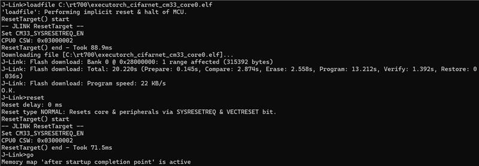
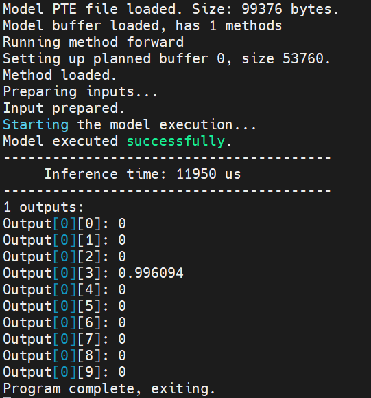
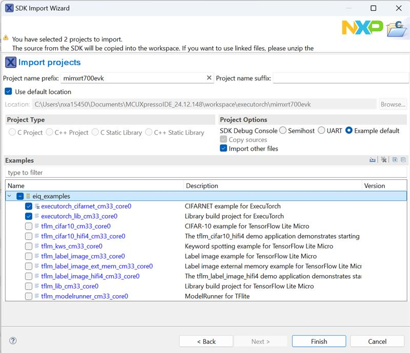
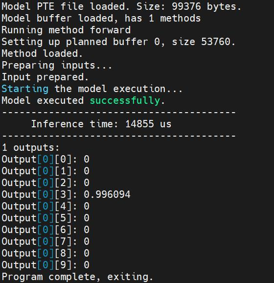
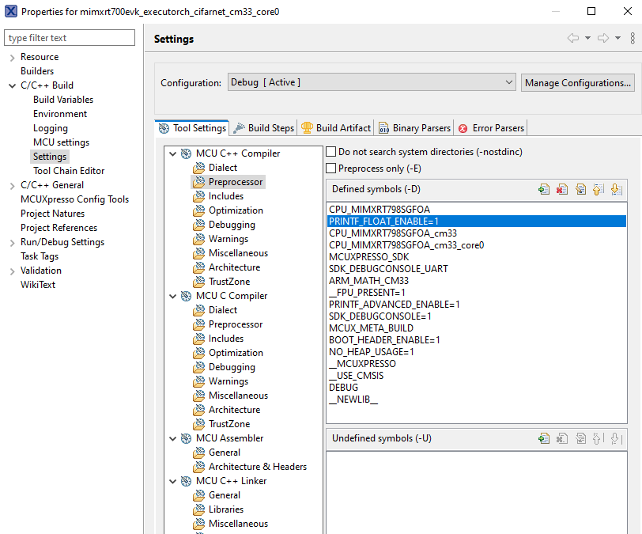

# MCUXpresso SDK Example applications

The MCUXpresso SDK provides a set of projects and example application with the eIQ ExecuTorch. For details, see [Table 1](example_applications.md#TABLE_LISTOFEXAMPLEAPP).

The eIQ ExecuTorch library is provided with a set of example applications. For details, see [Table 1](example_applications.md#TABLE_LISTOFEXAMPLEAPP). The applications demonstrate the usage of the library in several use cases.

|Name| Description                                                                                                                                                                                                                                                                                                                                    |Availability|
|----|------------------------------------------------------------------------------------------------------------------------------------------------------------------------------------------------------------------------------------------------------------------------------------------------------------------------------------------------|------------|
|`executorch_lib`| This project contains the ExecuTorch Runtime Library source code and is used to build the ExecuTorch Runtime Library. The library is further used to build a full application using the leveraging ExecuTorch.                                                                                                                                 | MIMXRT700-EVK \(no camera and display support\) |
|`executorch_cifarnet`| Example application demonstrating the use of the ExecuTorch running a CifarNet classification model accelerated on the eIQ Neutron NPU. The Cifarnet is a small Convolutional Neural Network \(CNN\), trained on [CIFAR-10](https://www.cs.toronto.edu/~kriz/cifar.html) [1] dataset. The model clasifies the input images into 10 caterories. | MIMXRT700-EVK \(no camera and display support\) |

For details on how to build and run the example applications with supported toolchains, see *Getting Started with MCUXpresso SDK User’s Guide* \(document: MCUXSDKGSUG\).

### How to build and run `executorch_cifarnet` example

The example needs ExecuTorch Runtime Library and Neutron Libraries.

ExecuTorch Runtime Library: 
* `middleware/eiq/executorch/lib/cm33/armgcc/libexecutorch.a`

Neutron Libraries:          
* `middleware/eiq/executorch/third-party/neutron/rt700/libNeutronDriver.a` and 
* `middleware/eiq/executorch/third-party/neutron/rt700/libNeutronFirmware.a`

In the example the model and the input image is already embedded into the program and ready to build and deploy to i.MX RT700, so you can continue right to the [building and deployment ](#build-deploy-and-run) section. 

#### Convert the model and example input to C array 
In this section we describe where the model and example input is located in the example application sources, and how it was generated.

The **cifar10 model** ExecuTorch model  is stored in `boards/mimxrt700evk/eiq_examples/executorch_cifarnet/cm33_core0/model_pte.h`.
and was generated from the `cifar10_nxp_delegate.pte` \(see [convert_model](convert_model.md)\).

We use the `xxd` command to get the C array containing the model data and array size: 
```commandline
$ xxd -i cifar10_nxp_delegate.pte > model_pte_data.h
```
then use the array data and size in the  `model_pte.h`.

As **input image** we use the image from [CIFAR-10](https://www.cs.toronto.edu/~kriz/cifar.html) dataset [1]. After preprocessing and normalization it is converted to bytes and located here `boards/mimxrt700evk/eiq_examples/executorch_cifarnet/cm33_core0/image_data.h`. 
The preprocessing is performed as follows: 
```python
import torch
import torchvision
import numpy as np

batch_size = 1

transform = torchvision.transforms.Compose([
  torchvision.transforms.ToTensor(),
  torchvision.transforms.Normalize((0.5, 0.5, 0.5), (0.5, 0.5, 0.5))
])

test_set = torchvision.datasets.CIFAR10(root='./data', train=False, download=True, transform=transform)
test_loader = torch.utils.data.DataLoader(test_set, batch_size=batch_size, shuffle=False, num_workers=0)

index = 0
num_images = 10
for data in test_loader:
  images, labels = data
  for image, label in zip(images,labels):
    arr = image.numpy().astype(np.float32)
    arr.tofile("img" + str(index) + "_" + str(int(label)) + ".bin")
    index = index + 1
    if index >= num_images:
      break
  if index >= num_images:
    break
```
This generates the `num_images` count of images from Cifar10 dataset, as input tensors for the cifar10 model and store them in corresponding `.bin` files. Then we use the xxd command to get the C array data and size: 
```commandline
$ xxd -i img0_3.bin > image_data_base.h
```
and again copy the array data and size in the  `image_data.h`

Note, the `img0` is the image picturing a cat, what is a class number 3. 

#### Build, Deploy and Run
1. When using ARMGCC toolchain, the example application can be built as below. After building the example application, download it to the target with JLink as shown in [Figure 3](example_applications.md#FIG_ARMGCCJLINKCOMMAND), an output message displays on the connected terminal as [Figure 4](example_applications.md#FIG_ARMGCCOUTPUT).
```commandline
$ boards/mimxrt700evk/eiq_examples/executorch_cifarnet/cm33_core0/armgcc$ ./build_flash_release.sh
```
 

2. When using MCUXpresso IDE, the example applications can be imported through the SDK Import Wizard as shown in [Figure 5](example_applications.md#FIG_IDEIMPORTWIZARD).



After building the example application and downloading it to the target, the execution stops in the *main* function. When the execution resumes, an output message displays on the connected terminal. For example, [Figure 6](example_applications.md#FIG_IDECOUTPUT) shows the output of the `executorch_cifarnet` example application.



In case of missing probabilities in the printed output, add PRINTF_FLOAT_ENABLE=1 to the Preprocessor settings for C++ and C compiler:



### How to build `executorch_lib` example

If you want to build a new ExecuTorch Runtime Library, follow the commands as below and use the new library to replace the default Runtime library `middleware/eiq/executorch/lib/cm33/armgcc/libexecutorch.a`.

1. When using ARMGCC toolchain, the example application can be built as below.
```commandline
$ boards/mimxrt700evk/eiq_examples/executorch_lib/cm33_core0/armgcc$ ./build_release.sh
$ boards/mimxrt700evk/eiq_examples/executorch_lib/cm33_core0/armgcc$ cp release/libexecutorch_lib_cm33_core0.a.a ../../../../../../middleware/eiq/executorch/lib/cm33/armgcc/libexecutorch.a
```

2. When using MCUXpresso IDE, the example applications can be imported through the SDK Import Wizard as shown in the above [Figure 5](example_applications.md#FIG_IDEIMPORTWIZARD).

After building the example application, copy the new library `mimxrt700evk_executorch_lib_cm33_core0\Debug\libmimxrt700evk_executorch_lib_cm33_core0.a` to replace the default Runtime library `mimxrt700evk_executorch_cifarnet_cm33_core0\eiq\executorch\lib\cm33\armgcc\libexecutorch.a`.

[1] [Learning Multiple Layers of Features from Tiny Images](https://www.cs.toronto.edu/~kriz/learning-features-2009-TR.pdf), Alex Krizhevsky, 2009