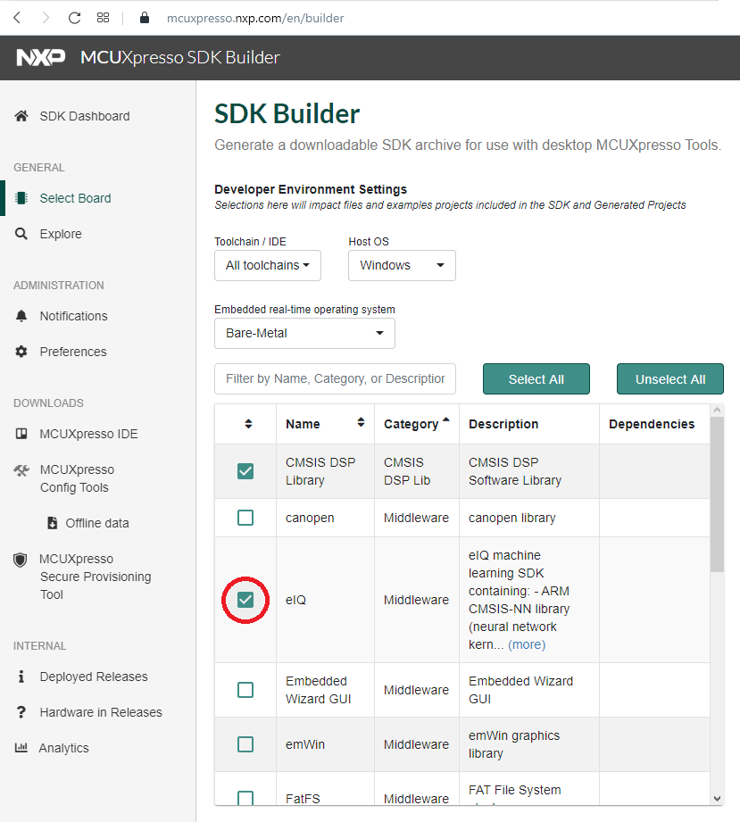

# Getting the MCUXpresso SDK with eIQ ExecuTorch 

The eIQ ExecuTorch library is part of the eIQ machine learning software package, which is an optional middleware component of MCUXpresso SDK. The eIQ component is integrated into the MCUXpresso SDK Builder delivery system available on [mcuxpresso.nxp.com](https://mcuxpresso.nxp.com). To include eIQ machine learning into the MCUXpresso SDK package, the eIQ middleware component is selected in the software component selector on the SDK Builder page when building a new package. See [Figure 1](deployment.md#FIG_BUILDERCOMPONENTSELECTOR).

Once the MCUXpresso SDK package is downloaded, it can be extracted on a local machine or imported into the MCUXpresso IDE. For more information on the MCUXpresso SDK folder structure, see the Getting Started with MCUXpresso SDK User’s Guide \(document: MCUXSDKGSUG\). The package directory structure is similar to [Figure 2](deployment.md#FIG_DIRECTORYSTRUCTURE).

The *boards* directory contains example application projects for supported toolchains. For the list of supported toolchains, see the *MCUXpresso SDK Release Notes*. The *middleware* directory contains the eIQ library source code and example application source code and data.
